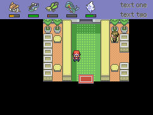

# Simple HUD
This script is for Pokémon Essentials. It displays a simple HUD with the party icons, HP bars and some small text.

## Screens

## Installation
Follow the [Script](/Script.rb) instructions.